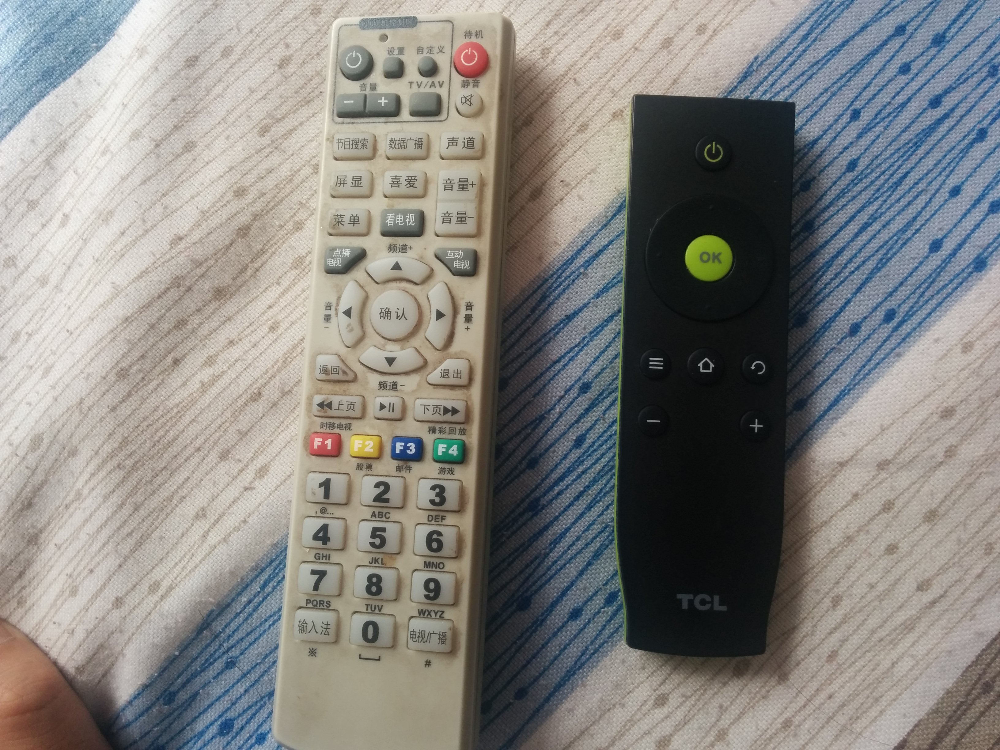

# 设计 × 性格

日本设计在我做网页设计时候，是公司极度推崇的，甚至老板都曾登门拜访过一些耳熟能详的大师。当时的分享会上，日本设计也是被当做一个课题反复学习。从设计行当转为程序开发，理由很多，其中一个理由，我想在这次有关日本设计的分享完成后，在文末说说。

在分享前，我坦诚并没有权威来证明自己的理解是对的，但有一点是明白的。设计和音乐一样，不在于故作深邃，让人听不懂看不明，而是让人舒服。舒服到让人觉察不到设计的存在，舒服到让人开心到爆，舒服到让你我don't think遥控器每一个按钮都做什么用？下边是随手拍的一张：

恩，到这里，我们也能对设计有一点蠢蠢欲动的小想法了。

拉回正题，最近循着一篇介绍日本针对儿童普及推广设计知识的系列短片《啊，设计》，NHK电视台已经出到108集，在B站找到了一个合集，整理了有20集，遂记点笔记分享：

短片魔性的BGM就不表了，毕竟是成年人的心魔作祟。先上图： 

第一眼看到这张图，想必都会惊艳到，而这只是这部每集只有15分钟不到的短片中必有的一环：**拆解**。上图的素材，不过是下边水果的拆解: 

想看过程，来：

 

继续

 

最后再拼盘就是我们的第一张。让我们再欣赏几张：

**葡萄拆解**

**玉米拆解**

**白菜拆解** 

一切皆可拆解？漫画：](/Users/AYA/Desktop/拆解艺术/11/屏幕快照 2016-10-04 16.21.52.png)

 

还有很多拆解都截了图做了收藏。看到这里，设计的一个要领已经被我们所领会：试着把所有的元素拆解开来，拆到物体的最小组件。接下来拼合，进入**设计的观察**环节，组合:   

设计这个抽象的工作，通过拆解，组合，思考，一下子变得有规律可循，也变得愈发可爱。在节目中，还有对大师的访谈小栏目，问题都很简单：如何成为一个好的设计师，如何能再设计上更加精进？

为此，在短小的20集集合中，对关注的内容做了下笔记：

**E06**:

* 拆解：扑克
* 设计师访谈 - 祖父江慎：努力设计让人怦然心动的感觉，真实传达各种情绪

**E07**

* 设计的观察：寿司及横切面内部结构
* 设计师访谈 - 照明设计师面出薰:  照明是非常有趣的元素，白色的光变成橘色暖光，说话就很融洽。把灯关了，点上蜡烛，享受微暗之美

**E08**

* 设计的观察： 文字:文字如何印刷 & 文字多种表现

* 拆解：球鞋
* 设计师访谈 - 家具设计师小泉诚：使用重铁，创造重却不失好用的工具

**E10**

* 设计的观察：食物：多种颜色+创意，及涉及到装盒
* 设计师访谈 - 吉罔德仁

**E11**

* 拆解：漫画

**E13**

* 拆解：灯笼

**E16**

* 设计师访谈 - 原研哉

**E17**

* 拆解: 书柜 衣柜

* 设计师访谈 - 广村正彰：标志设计

**E19**

* 设计的观察：椅子及各种坐姿

到此，这个小分享渐渐和名字取得不再相符，所以要谈谈自我不成熟的看法。设计的一些要领不外乎短片反复强调的一些`tips`,除了感慨精妙外，是否此刻想想我们是否如此真正完成过一个设计，推而广之是一件自己的作品，自己经手的项目。从短片，除了要领，我觉得需要真正提高的是：

* 耐心：有耐心一点一点进行拆解，探究，坚持不懈
* 热爱：热爱所从事的工作，创造美好事物

这便是我理解的设计性格，编程性格，发展性格。

末了，从设计到编程的转行，并非不热爱，只是成为优秀的设计师，时间是一个基本要求。无知如我，总需要更多品品这生活，更多看看这世界，然后一切尘埃落定，欣赏设计这瓶陈年酒。